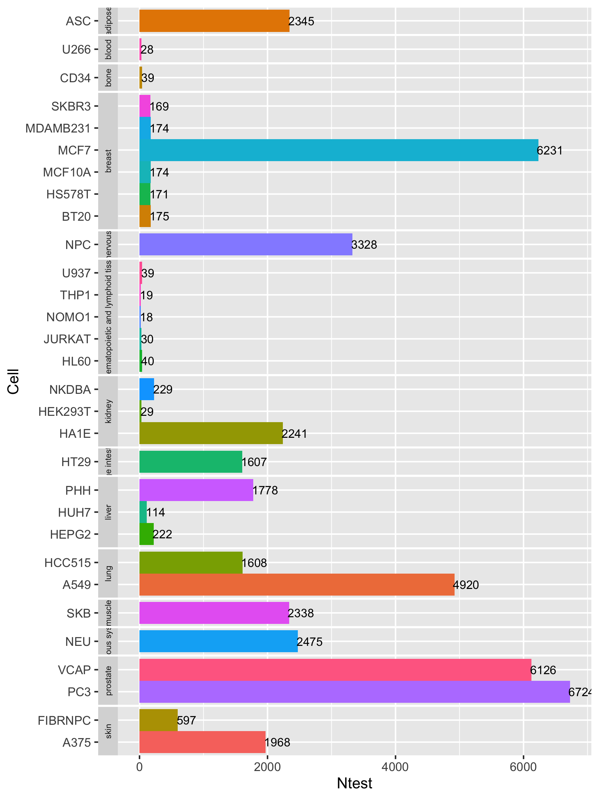

```{r setup, include=FALSE}
knitr::opts_chunk$set(echo = TRUE)
```

```{r}
if (!requireNamespace("BiocManager", quietly = TRUE))
  install.packages("BiocManager")
BiocManager::install("signatureSearch")
# BiocManager::install("yduan004/signatureSearch", build_vignettes=TRUE) # installs from github
```

```{r}
library(signatureSearch)
```

```{r}
library(help = "signatureSearch") # lists package info
vignette("signatureSearch") # opens vignette
```

```{r}
library(ExperimentHub); library(rhdf5)
eh <- ExperimentHub()
cmap <- eh[["EH3223"]]; cmap_expr <- eh[["EH3224"]]
lincs <- eh[["EH3226"]]; lincs_expr <- eh[["EH3227"]]
h5ls(lincs)
```

```{r}
db_path <- system.file("extdata", "sample_db.h5", package = "signatureSearch")
# load sample_db as `SummarizedExperiment` object
library(SummarizedExperiment); library(HDF5Array)
sample_db <- SummarizedExperiment(HDF5Array(db_path, name="assay"))
rownames(sample_db) <- HDF5Array(db_path, name="rownames")
colnames(sample_db) <- HDF5Array(db_path, name="colnames")
# get "vorinostat_SKB_trt_cp" signature drawn from toy database
# the vignette didn't work with indexing by name so I used the numerical index
query_mat <- as.matrix(assay(sample_db[,1]))
# the code should read: "query_mat <- as.matrix(assay(sample_db[,"vorinostat__SKB__trt_cp"]))
query = as.numeric(query_mat); names(query) = rownames(query_mat)
upset <- head(names(query[order(-query)]), 150)
head(upset)
```

```{r}
downset <- tail(names(query[order(-query)]), 150)
head(downset)
```

```{r}
qsig_cmap <- qSig(query = list(upset=upset, downset=downset),
                  gess_method="CMAP", refdb=db_path)
```

```{r}
cmap <- gess_cmap(qSig=qsig_cmap, chunk_size=5000, workers=1)
cmap
```

```{r}
result(cmap)
```

```{r}
qsig_lincs <- qSig(query = list(upset=upset, downset=downset),
                   gess_method="LINCS", refdb=db_path)
```

```{r}
lincs <- gess_lincs(qsig_lincs, sortby="NCS", tau=FALSE, workers=1)
result(lincs)
```

```{r}
qsig_gcmap <- qSig(query = query_mat, gess_method = "gCMAP", refdb = db_path)
gcmap <- gess_gcmap(qsig_gcmap, higher=1, lower=-1, workers=1)
result(gcmap)
```

<<<<<<< HEAD
```{r}
qsig_fisher <- qSig(query = query_mat, gess_method = "Fisher", refdb = db_path)
fisher <- gess_fisher(qSig=qsig_fisher, higher=1, lower=-1, workers=1)
result(fisher)
```

```{r}
qsig_fisher2 <- qSig(query = list(upset=upset, downset=downset),
                     gess_method = "Fisher", refdb = db_path)
fisher2 <- gess_fisher(qSig=qsig_fisher2, higher=1, lower=-1, workers=1)
result(fisher2)
```

```{r}
qsig_sp <- qSig(query = query_mat, gess_method = "Cor", refdb = db_path)
sp <- gess_cor(qSig=qsig_sp, method="spearman", workers=1)
result(sp)
```

```{r}
# subset z-scores of 150 up and down gene sets from
# "vorinostat__SKB__trt_cp" signature
query_mat_sub <- as.matrix(query_mat[c(upset, downset), ])
qsig_spsub <- qSig(query = query_mat_sub, gess_method = "Cor", refdb = db_path)
spsub <- gess_cor(qSig=qsig_spsub, method="spearman", workers=1)
result(spsub)
```

```{r}
vor_qsig_full <- qSig(query = list(upset=upset, downset=downset),
                      gess_method="LINCS", refdb="lincs")
vori_res_full <- gess_lincs(qSig=vor_qsig_full, sortby="NCS", tau=TRUE)
vori_tb <- result(vori_res_full)
drugs_top10 <- unique(result(lincs)$pert)[1:10]
drugs_hdac <- c("panobinostat", "mocetinostat", "ISOX", "scriptaid", "entinostat", 
                "belinostat", "HDAC3-selective", "tubastatin-a", "tacedinaline", "depudecin")
drugs = c(drugs_top10, drugs_hdac)
gess_res_vis(vori_tb, drugs = drugs, col = "NCS")
```
Figure 3: Summary of NCS scores across cell types (y-axis) for selected drugs (x-axis). The plot shown here is based on a search result where the vorinostat signature was used to query the entire LINCS database with the gess_lincs method. The drugs included here are the 10 top ranking drugs of the search result plus 10 cherry-picked drugs that are all HDAC inhibitors. Additional details are provided in the text of this sub-section.

```{r}
library("ggplot2")
```

```{r}
# cellNtestPlot(refdb="lincs")
cellNtestPlot(refdb="lincs")
ggsave("lincs_cell_ntest.png", width=6, height=8)
# ggsave("vignettes/images/lincs_cell_ntest.png", width=6, height=8)
```

```{r}

```

```{r}
data("cell_info")
library(DT)
datatable(cell_info)
```

```{r}
library(readr)
batch_queries <- list(q1=list(upset=c("23645", "5290"), downset=c("54957", "2767")),                  q2=list(upset=c("27101", "65083"), downset=c("5813", "84")))
refdb <- system.file("extdata", "sample_db.h5", package="signatureSearch")
gess_list <- lapply(seq_along(batch_queries), function(i){
  qsig_lincs <- qSig(query = batch_queries[[i]],
                     gess_method="LINCS", refdb=refdb)
  lincs <- gess_lincs(qsig_lincs, sortby="NCS", tau=TRUE)
  if(!dir.exists("batch_res"))
  {dir.create("batch_res")
  }
  write_tsv(result(lincs), paste0("batch_res/lincs_res_", i, ".tsv"))
  return(result(lincs))
})
```

```{r}
library(BiocParallel)
f_bp <- function(i){
  qsig_lincs <- qSig(query = batch_queries[[i]],
                     gess_method="LINCS", refdb=refdb)
  lincs <- gess_lincs(qsig_lincs, sortby="NCS", tau=TRUE)
  if(!dir.exists("batch_res")){
    dir.create("batch_res")
  }
  write_tsv(result(lincs), paste0("batch_res/lincs_res_", i, ".tsv"))
  return(result(lincs))
}
gess_list <- bplapply(seq_along(batch_queries), f_bp, BPPARAM = MulticoreParam(workers = 2))
```

```{r}
# install.packages("batchtools")
```

```{r}
library(batchtools)
batch_queries <- list(q1=list(upset=c("23645", "5290"), downset=c("54957", "2767")),
                      q2=list(upset=c("27101", "65083"), downset=c("5813", "84")))
refdb <- system.file("extdata", "sample_db.h5", package="signatureSearch")

f_bt <- function(i, batch_queries, refdb){
  library(signatureSearch)
  library(readr)
  qsig_lincs <- qSig(query = batch_queries[[i]],
                     gess_method="LINCS", refdb=refdb)
  lincs <- gess_lincs(qsig_lincs, sortby="NCS", tau=TRUE)
  if(!dir.exists("batch_res")){
    dir.create("batch_res")
  }
  write_tsv(result(lincs), paste0("batch_res/lincs_res_", i, ".tsv"))
  return(result(lincs)) # or return()
}
```

```{r}
file.copy(system.file("extdata", ".batchtools.conf.R", package="signatureSearch"), ".")
file.copy(system.file("extdata", "slurm.tmpl", package="signatureSearch"), ".")
```

```{r}
reg <- makeRegistry(file.dir="reg_batch", conf.file=".batchtools.conf.R")
# reg <- loadRegistry(file.dir="reg_batch", conf.file=".batchtools.conf.R", writeable=TRUE)
Njobs <- 1:2
ids <- batchMap(fun=f_bt, Njobs, more.args = list(
  batch_queries=batch_queries, refdb=refdb))
```

The following package dependencies were loaded upon recommendation.

```{r}
library("AnnotationDbi")
library("data.table")
library("magrittr")
library("RSQLite")
library("dplyr")
library("fgsea")
library("scales")
library("qvalue")
library("reshape2")
library("visNetwork")
library("fastmatch")
library("reactome.db")
library("clusterProfiler")
library("DOSE")
library("GSEABase")
```

The following package was install and loaded upon recommendation. The package is similar to "batchtools".

```{r}
install.packages("BatchJobs")
```

```{r}
library("BatchJobs")
```

```{r}
Sys.which('squeue')
```

The following three chunks of code (33, 34, 35) were skipped due to a command line issue that could not be resolved. The code has been hashed out and will not be run alongside the other coding lines if the entire script is run. This issue will be addressed only if proven necessary in the future.

```{r}
# batchtools::submitJobs(ids, reg=reg, resources=list(
     # partition=“intel”, walltime=120, ntasks=1, ncpus=4, memory=10240))
```

```{r}
# submitJobs(ids, reg=reg, resources=list(
     # partition="intel", walltime=120, ntasks=1, ncpus=4, memory=10240))
```

```{r}
# getStatus()
# waitForJobs() # wait until all jobs are completed
# resl <- loadResult(1)
# unlink(c(".batchtools.conf.R", "slurm.tmpl"))
```

```{r}
drugs <- unique(result(lincs)$pert[1:10])
dup_hyperG_res <- tsea_dup_hyperG(drugs = drugs, universe = "Default",
                                  type = "GO", ont="MF", pvalueCutoff=0.05,
                                  pAdjustMethod="BH", qvalueCutoff = 0.1,
                                  minGSSize = 10, maxGSSize = 500)
dup_hyperG_res
```

```{r}
result(dup_hyperG_res)
```

```{r}
dup_hyperG_k_res <- tsea_dup_hyperG(drugs = drugs, universe = "Default",
                                    type = "KEGG", pvalueCutoff=0.5,
                                    pAdjustMethod="BH", qvalueCutoff = 0.5,
                                    minGSSize = 10, maxGSSize = 500)
result(dup_hyperG_k_res)
```

```{r}
dup_rct_res <- tsea_dup_hyperG(drugs=drugs, type="Reactome",
                               pvalueCutoff=0.5, qvalueCutoff=0.5, readable=TRUE)
result(dup_rct_res)
```

```{r}
mgsea_res <- tsea_mGSEA(drugs=drugs, type="GO", ont="MF", exponent=1,
                        nPerm=1000, pvalueCutoff=1, minGSSize=5)
result(mgsea_res)
```

```{r}
mgsea_k_res <- tsea_mGSEA(drugs=drugs, type="KEGG", exponent=1,
                          nPerm=1000, pvalueCutoff=1, minGSSize=2)
result(mgsea_k_res)
```

```{r}
mgsea_rct_res <- tsea_mGSEA(drugs=drugs, type="Reactome", pvalueCutoff=1,
                            readable=TRUE)
result(mgsea_rct_res)
```

```{r}
mabs_res <- tsea_mabs(drugs=drugs, type="GO", ont="MF", nPerm=1000,
                      pvalueCutoff=0.05, minGSSize=5)
result(mabs_res)
```

```{r}
mabs_k_res <- tsea_mabs(drugs=drugs, type="KEGG", nPerm=1000,
                        pvalueCutoff=0.2, minGSSize=5)
result(mabs_k_res)
```

```{r}
mabs_rct_res <- tsea_mabs(drugs=drugs, type="Reactome", pvalueCutoff=1,
                          readable=TRUE)
result(mabs_rct_res)
```

```{r}
drugs <- unique(result(lincs)$pert[1:10])
hyperG_res <- dsea_hyperG(drugs=drugs, type="GO", ont="MF")
result(hyperG_res)
```

```{r}
hyperG_k_res <- dsea_hyperG(drugs = drugs, type = "KEGG",
                            pvalueCutoff = 1, qvalueCutoff = 1,
                            minGSSize = 10, maxGSSize = 2000)
result(hyperG_k_res)
```

```{r}
d1 <- abs(result(lincs)$NCS); names(d1) <- result(lincs)$pert
d1 <- d1[d1>0]
d1 <- d1[!duplicated(names(d1))]
gsea_res <- dsea_GSEA(drugList=d1, type="GO", ont="MF", exponent=1, nPerm=1000,
                      pvalueCutoff=0.2, minGSSize=5)
result(gsea_res)
```

```{r}
gsea_k_res <- dsea_GSEA(drugList=d1, type="KEGG", exponent=1, nPerm=1000,
                        pvalueCutoff = 1, minGSSize = 5)
result(gsea_k_res)
```

```{r}
table_list = list("dup_hyperG" = result(dup_hyperG_res),
                  "mGSEA" = result(mgsea_res),
                  "mabs" = result(mabs_res),
                  "hyperG" = result(hyperG_res),
                  "GSEA" = result(gsea_res))
comp_fea_res(table_list, rank_stat="pvalue", Nshow=20)
```
Figure 5: Ranking comparison of top GO terms across FEA methods. The dots in the plot represent the p-values of the 20 top ranking MF GO terms (y-axis) with heat color coding according to the color gradient in the legend on the right. The GO terms have been ordered from the top to the bottom of the plot by increasing mean rank values calculated for each GO term across the 5 FEA methods (x-axis).

```{r}
table_list = list("dup_hyperG" = result(dup_hyperG_k_res),
                  "mGSEA" = result(mgsea_k_res),
                  "mabs" = result(mabs_k_res),
                  "hyperG" = result(hyperG_k_res),
                  "GSEA" = result(gsea_k_res))
comp_fea_res(table_list, rank_stat="pvalue", Nshow=20)
```

```{r}
dtnetplot(drugs = drugs(dup_hyperG_res), set = "GO:0032041", ont = "MF",
          desc="NAD-dependent histone deacetylase activity (H3-K14 specific)")
```
Figure 7: Drug-target network for NAD-dependent histone deacetylase activity. The given network graph illustrates the interactions among drugs and their target proteins in the chosen pathway. Only drugs with at least one target protein are included. The nodes in the network represent drugs and targets depicted as squares and circles, respectively. The interactions among drugs and targets are indicated by non-weighted lines (yes/no relationship). The color of the nodes is defined by the number of their connections to other nodes. 

```{r}
dtnetplot(drugs = drugs(dup_hyperG_res), set = "GO:0051059", ont = "MF", 
          desc="NF-kappaB binding")
```
Figure 8: Drug-target network for NF-kappaB binding. The details of the plot are given in the legend of Figure 7. 

```{r}
dtnetplot(drugs = drugs(dup_hyperG_k_res), set = "hsa05034",
          desc="Alcoholism")
```
Figure 9: Drug-target network for Alcoholism. The details of the plot are given in the legend of Figure 7. 

```{r}
dtnetplot(drugs = drugs, set = "hsa04213",
          desc="Longevity regulating pathway - multiple species")
```
Figure 10: Drug-target network for Longevity regulating pathway. The details of the plot are given in the legend of Figure 7. 

```{r}
drug <- "vorinostat"; cell <- "SKB"
refdb <- system.file("extdata", "sample_db.h5", package="signatureSearch")
env_dir <- tempdir()
wf_list <- runWF(drug, cell, refdb, gess_method="LINCS",
                 fea_method="dup_hyperG", N_gess_drugs=10, env_dir=env_dir, tau=FALSE)
```

```{r}
msig <- read_gmt("msigdb.v7.4.entrez.gmt") # 25,724
```

```{r}
db_path <- system.file("extdata", "sample_db.h5", package = "signatureSearch")
```

The following example is for unlabeled query gene sets that lack information about up- or down-regulation.
```{r}
# gene_set <- msig[["GO_GROWTH_HORMONE_RECEPTOR_BINDING"]]
# CMAP method
# cmap_qsig <- qSig(query=list(upset=gene_set), gess_method="CMAP", refdb=db_path)
# cmap_res <- gess_cmap(cmap_qsig, workers=1)
# LINCS method
# lincs_qsig <- qSig(query=list(upset=gene_set), gess_method="LINCS", refdb=db_path)
# lincs_res <- gess_lincs(lincs_qsig, workers=1)
# Fisher methods
# fisher_qsig <- qSig(query=list(upset=gene_set), gess_method="Fisher", refdb=db_path)
# fisher_res <- gess_fisher(fisher_qsig, higher=1, lower=-1, workers=1)
```
Alternatively, query gene sets with up and down labels can be used as shown below.
```{r}
gene_set_up <- msig[["GSE17721_0.5H_VS_24H_POLYIC_BMDC_UP"]]
gene_set_down <- msig[["GSE17721_0.5H_VS_24H_POLYIC_BMDC_DN"]]
# CMAP method
cmap_qsig <- qSig(query=list(upset=gene_set_up, downset=gene_set_down),
                  gess_method="CMAP", refdb=db_path)
cmap_res <- gess_cmap(cmap_qsig, workers=1)
# LINCS method
lincs_qsig <- qSig(query=list(upset=gene_set_up, downset=gene_set_down),
                   gess_method="LINCS", refdb=db_path)
lincs_res <- gess_lincs(lincs_qsig, workers=1)
# Fisher methods
fisher_qsig <- qSig(query=list(upset=gene_set_up, downset=gene_set_down),
                    gess_method="Fisher", refdb=db_path)
fisher_res <- gess_fisher(fisher_qsig, higher=1, lower=-1, workers=1)
```

```{r}
gmt2h5(gmtfile="./msigdb.v7.4.entrez.gmt", dest_h5="./msigdb.h5", by_nset=1000,
       overwrite=TRUE)

# gCMAP method
query_mat <- getSig(cmp="vorinostat", cell="SKB", refdb=db_path)
gcmap_qsig2 <- qSig(query=query_mat, gess_method="gCMAP", refdb="./msigdb.h5")
```

```{r}
gcmap_res2 <- gess_gcmap(gcmap_qsig2, higher=1, workers=1, chunk_size=2000)

# Fisher method
msig <- read_gmt("msigdb.v7.4.entrez.gmt")
gene_set <- msig[["GO_GROWTH_HORMONE_RECEPTOR_BINDING"]]
fisher_qsig2 <- qSig(query=list(upset=gene_set), gess_method="Fisher",
                     refdb="./msigdb.h5")
fisher_res2 <- gess_fisher(fisher_qsig2, higher=1, workers=1, chunk_size=2000)
```


```{r}
gmt2h5(gmtfile="./mGSKB_Entrez.gmt", dest_h5="./mGSKB.h5", by_nset=1000,
       overwrite=TRUE)

# gCMAP method
## Construct a toy query (here matrix)
gskb <- read_gmt("mGSKB_Entrez.gmt") # 41,546
mgenes <- unique(unlist(gskb))
ranks <- rev(seq_along(mgenes))
mquery <- matrix(ranks, ncol=1)
rownames(mquery) <- mgenes; colnames(mquery) <- "MAKE_UP"
gcmap_qsig3 <- qSig(query=mquery, gess_method="gCMAP",
                    refdb="./mGSKB.h5")
```

```{r}
gcmap_res3 <- gess_gcmap(gcmap_qsig3, higher=1, workers=1, chunk_size=2000)

# Fisher method
gene_set <- gskb[["LIT_MM_HOFFMAN_PRE-BI_VS_LARGE-PRE-BII-CELL_DIFF_Entrez"]]
fisher_qsig3 <- qSig(query=list(upset=gene_set), gess_method="Fisher",
                     refdb="./mGSKB.h5")
fisher_res3 <- gess_fisher(fisher_qsig3, higher=1, workers=1, chunk_size=2000)
```

The following provides the code for constructing the toy database used by the sample code of this vignette. To save time building this vignette, the evaluated components of its sample code use a pre-generated instance of the toy database that is stored in the extdata directory of the signatureSearch package. Thus, the following code section is not evaluated. It also serves as an example how to construct other custom instances of the LINCS database. Additional details on this topic are provided in the vignette of the signatureSearchData package. 
```{r}
#library(rhdf5)
#eh <- ExperimentHub::ExperimentHub()
#lincs <- eh[["EH3226"]]
#hdacs <- c("vorinostat", "trichostatin-a", "pyroxamide", "HC-toxin", "rhamnetin")
#hdacs_trts <- paste(hdacs, "SKB", "trt_cp", sep="_")
#all_trts <- drop(h5read(lincs, "colnames"))
# select treatments in SKB cell and not BRD compounds
#all_trts2 <- all_trts[!grep1("BRD-", all_trts) & grep1("_SKB_", all_trts)]
#set.seed(11)
#rand_trts <- sample(setdiff(all_trts2, hdacs_trts), 95)
#toy_trts <- c(hdacs_trts, rand_trts)
#library(SummarizedExperiment); library(HDF5Array)
#toy_db <- SummarizedExperiment(HDF5Array(lincs, name="assay"))
#rownames(toy_db) <- HDF5Array(db_path, name="rownames")
#colnames(toy_db) <- HDF5Array(db_path, name="colnames")
#toy_db <- round(as.matrix(assay(toy_db)[,toy_trts]),2)
#set.seed(11)
#gene_idx <- sample.int(nrow(toy_db),5000)
#toy_db2 <- toy_db[gene_idx,]
# the sample_db is stored in the current directory of user's R session
#getwd()
#createEmptyH5("sample_db.h5", level=9, delete_existing=TRUE)
#append2H5(toy_db2, "sample_db.h5")
#h5ls("sample_db.h5")
```

```{r}
sessionInfo()
```

